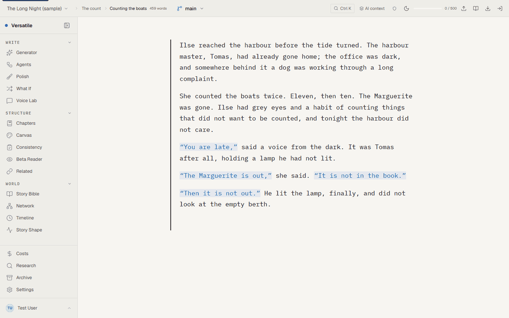

# Versatile — Fiction Writing Assistant

[](https://github.com/yosrikhiari/Versatile/actions/workflows/ci.yml) [](https://github.com/yosrikhiari/Versatile/actions/workflows/backend-ci.yml)

An offline-first fiction writing environment: a distraction-free editor, a story bible, chapters / scenes / timeline, a story network graph, and a local-AI pipeline that plans, drafts and critiques whole books on your own machine. Built with Vue 3, Pinia and Dexie (IndexedDB); Ollama by default for every model call; an optional .NET 10 backend for accounts, sync and collaboration.

Nothing leaves the device unless you opt in — the cloud tier is per-project and discloses exactly what it sends.



<sub>The sample story, on the local build. The Agents panel ([full size](docs/img/agents-panel.png)) is where each role — Director, Writer, Critic, Editor — gets a model and a device, and where a run can be traced through AgentOps.</sub>

## Features

### Writing Environment

- **Rich text editor** powered by Tiptap 3 with distraction-free interface
- **Flow Sessions** — timed writing sprints with word count goals, idle detection, and nudge reminders
- **Focus Mode** — minimal UI for uninterrupted writing
- **Auto-save** to local IndexedDB via Dexie; content snapshots dedup and cap per chapter
- **Command palette** (Ctrl+K) sharing one definition with the sidebar
- **Tool panels dock to the right** of a canvas-dominant layout; every panel shares one header/section grammar (`src/components/ui/`)

### AI-Powered Tools

- **Spark** — AI prompts and outlines from user-provided ideas
- **Polish** — paragraph-level prose analysis (repetition, pacing, dialogue, show-don't-tell, etc.)
- **Story Generator** — Ideate / Chapter / Arc / Blurb tabs over one pipeline: bible → network → plan → spine → prose → consistency → chapter gate
- **Director / Writer / Critic** — the three LLM roles, with streaming output, per-scene quality scoring, and warn-only gates that never discard prose
- **Multi-agent orchestration on LangGraph** (opt-in, `Settings → AI → Generation orchestrator`) — the Writer and the Critic run as separate agents on separate device lanes (the Critic judges scene N on the CPU while the Writer drafts N+1 on the GPU, so the judge can be a different model with zero swaps on 8 GB), an Editor agent decides each step in `agentic` mode inside a fence of legal moves, every decision is logged, and the graph checkpoints per step so a killed tab resumes mid-chapter. Role placement (which model, which device) is a Settings table with a one-click preset. ADR-0001.
- **Digest layer** — per-scene digests rolled up into chapter and volume digests, an entity-state timeline, and deterministic contradiction rules that run before any LLM call
- **Cloud escalation (opt-in, per project)** — route whole-manuscript audits or second-opinion critiques to a cloud provider with an explicit disclosure of what is sent
- **Entity Generation** — AI-assisted character, location, and plot thread creation
- **Embedding-Similarity Retrieval** — IVF vector index in a worker for context selection on long stories
- **Context Budgeting** — real token budgets per model, calibrated from observed usage
- **Author Voice Learning** — statistical voice profiling without LLM calls
- **Beta Reader / Consistency / What If / Story Shape / Voice Lab / Character Chat** panels

### Import a novel, then ask "What if…?"


- **Import** a manuscript (`.txt`, `.md`, `.docx`, `.epub`, `.html`) with a preview first. Chapters are found from the file's own headings, then its contents page, then running numbers; scenes split at the author's breaks ([how](docs/img/diagrams/import-chapter-detection.svg)).
- **Read the book once**: the local model reads each scene and fills the story bible, the network and the scene digests through the same code a generated book uses. Every result is saved as it lands, so a stopped read resumes at the next unread scene ([pipeline](docs/img/diagrams/book-reading-pipeline.svg)). *Ethan Frome* reads in about 11 minutes, *The Time Machine* in 15, on an 8 GB GPU.
- **What If** turns a premise ("What if Zeena never goes to Bettsbridge?") into a branch: a full copy of the book, a plan for every later scene (keep, rewrite or drop, all editable), the rewritten scenes written by the book's own writer, and a merge of only the scenes you pick back into the main book, snapshot first.


- **Every scene after the change is checked**, in order, against the change and the facts of the scenes before it ([fact check](docs/img/diagrams/whatif-fact-check.svg)), and a **who-is-where** check follows each person the change names: someone last shown at home and later treated as gone, with no scene showing them leave, is flagged for review, never silently rewritten ([how](docs/img/diagrams/whatif-who-is-where.svg)).
- **Rewrite this scene** writes a flagged scene again with the missing event as a rule in its brief, checks only that scene, and keeps the old text for **Undo** ([flow](docs/img/diagrams/whatif-rewrite-scene.svg)).
- The planner decides each scene from its summary, then takes a **second look** at any scene it would keep, reading that scene's own sentences about the people the change is about ([why](docs/img/diagrams/whatif-planner-second-look.svg)).

How each part was measured, including what did not work, is in [`docs/REPORT.md`](docs/REPORT.md) (the full report, with its 174 diagrams) and `docs/GENERATION-PIPELINE-ANALYSIS.md` §37–§45. The design is in `ARCHITECTURE.md` and `docs/WHATIF-AND-IMPORT-PLAN.md`.

### Knowing your story (Obsidian-style)

- **Properties & tags** on every character, location and plot thread; **POV / setting / cast** on every scene, set by hand or by the generator, and read back by the digest layer
- **Story Query** — a Bases/Dataview-style table over scenes, chapters and entities: filters, All/Any, sort, group, inline edit. "Which draft scenes have no characters?" is one click
- **Related** — what in the story is semantically close to the scene you are in, by local embeddings; link a hit into the graph
- **Ask the story** (lookup) and **Ask your story** (chat) — plain-words search and grounded Q&A with citations that open the scene
- **Templates** — Scene / Chapter opener / Climax (and your own) that insert at the cursor and set the scene's POV, setting and cast
- **Story Network** — force-directed graph with relationship-type filters, a **local graph** view (click a node, see its neighbourhood), and find-a-node
- **Story Canvas** — a board, or a **map** with an uploaded image and pinned, draggable entities
- **Timeline**, **Scene Outline**, **Volumes** and **Branches**

### Planning & Organization

- **Story Bible** — characters, locations, plot threads, relationships
- **Chapter & Scene Management** — section/subsection hierarchy with drag-and-drop reordering; a project's structure terms adapt to its workspace type (a novel says Chapters/Scenes, a screenplay Scenes/Beats)

### Export & Archive

- **Compile** the manuscript in narrative order to **Markdown, Word (.docx), EPUB** or **PDF**
- Session history archive with author model tracking
- Goal tracking (session and daily word counts) across the whole manuscript, not just the root document

## Architecture

```
src/
├── components/         — 144 Vue components across 29 feature dirs
│   └── ui/             — Base* primitives (panel header, section, button, chip, field …)
├── composables/        — ~150 composition modules
│   ├── generation/     — the generation engine, split by concern:
│   │   ├── writing/    — sceneGate, parallelStrategy, batchStrategy, liveDraft, limits
│   │   ├── context/    — scene / entity / manuscript / relationship context, spine
│   │   ├── commit/     — CommitService (persist + digest at commit time)
│   │   ├── consistency/, delegator/, lifecycle/, pipeline/, schemas/, shaping/ …
│   │   ├── runMechanics.ts, evalBootstrap.ts, checkpoint.ts
│   │   └── useChapterStoryGenerator.ts, useGenerationRunController.ts
│   ├── useVolumeStoryGenerator.ts  — orchestrator (phase machine + resume)
│   ├── useStoryDirector.ts         — planning (skeleton + per-chapter scenes)
│   ├── useStoryWriter.ts           — prose + metadata extraction
│   ├── useStoryCritic.ts           — scoring and contradiction audit
│   ├── useBookAnalysis.ts          — read an imported book: bible, network, digests
│   ├── useWhatIfBranch.ts          — What If: fork, plan, write, check, rewrite, merge
│   └── ...
├── services/           — ~135 modules
│   ├── db-schema.ts / db-core.ts   — Dexie schema (v55), 25 db-* table modules
│   ├── storyQuery.ts / storyVectorIndex.ts / compileManuscript.ts — query, semantic index, compile
│   ├── aiService.ts    — unified AI provider interface
│   ├── providers/      — OpenAI, Anthropic, Gemini, Groq, Ollama adapters
│   ├── ai/             — token calibration, model/context budgets, prompt store
│   ├── generation/     — digests, rollups, deterministic contradictions, gates, run health
│   ├── import/         — decoders (txt/md/docx/epub/html), chapter detection, project writer
│   ├── whatIf/         — the What If planner prompts and the who-is-where check
│   ├── vectorIndex*.ts — IVF index + worker
│   └── sync-engine.ts  — offline-to-server sync (14 synced tables)
├── stores/             — 23 Pinia stores (setup syntax)
├── config/             — providers, models, prompts, eval rubrics, gate config, workspaces
└── tests/              — unit (288 files), integration, audit, evaluation, live
```

See `ARCHITECTURE.md` for the system map, `API.md` for the backend contract, `TESTING.md` for every suite, and `docs/GENERATION-PIPELINE-ANALYSIS.md` for how a run behaves.

## Getting Started

### Prerequisites

- **Node.js** 22.22+ (jsdom 30 needs it; CI runs 22.x and the frontend image builds on `node:22-alpine`)
- **Ollama** (recommended) for local AI inference — or API keys for OpenAI/Anthropic/Gemini/Groq

### Install & Run

```bash
git clone <repo-url>
cd versatile
npm install
npm run dev
```

The dev server starts at `http://localhost:5173`.

Run `npm install` again after every pull that touches `package.json`. With a stale
`node_modules` the editor route fails to compile (Vite reports a missing export from
`@tiptap/vue-3`) while the login and workspace pages still load, which looks like an app bug.

### Ollama Setup (Local AI)

1. Install [Ollama](https://ollama.com)
2. Pull the default: `ollama pull qwen3:8b` (prose, planning, metadata, critic); `ollama pull nomic-embed-text` for embeddings
3. The dev server proxies `/ollama` to `http://localhost:11434`

`qwen3:8b` writes the prose by default (`src/config/ollama.ts`). It is the model that passes the quality gate: on the reference 8 GB GPU, the full 10-chapter run had 29 of 30 scenes pass, while the uncensored `dolphin-mistral:7b` failed 3 of 3 under the same critic (voice 6, show/tell 5). Dolphin is an explicit opt-in — `ollama pull dolphin-mistral:7b`, then pick it as the prose model in Settings → AI — for content qwen3 refuses to write plainly. Utility work (planning, metadata, critic) keeps its own default and never inherits the prose choice. Numbers: `docs/GENERATION-PIPELINE-ANALYSIS.md` §8.

### Configuration

- **AI Providers**: Configured via the Settings modal in-app — supports Ollama (default), OpenAI, Anthropic, Gemini, Groq
- **Per-feature models**: Each AI feature can use a different provider/model
- **Cloud audit**: per-project opt-in (`cloudAuditOptIn`) plus a global `analysisTier` setting; off by default
- **Portrait generation**: Optional Stable Diffusion integration (proxied to `http://127.0.0.1:7860`)

### Optional backend

The .NET 10 API adds accounts, organisations, sync and collaboration. `docker compose up` starts Postgres, Redis and the API; `--profile frontend` adds the nginx-served SPA and `--profile ollama` a local Ollama. See `docs/DEPLOYMENT.md`.

## Scripts

| Script                     | Description                                                     |
| -------------------------- | --------------------------------------------------------------- |
| `npm run dev`              | Start development server                                        |
| `npm run build`            | Production build (pre-compressed `.br`/`.gz` assets)            |
| `npm run preview`          | Preview production build                                        |
| `npm test`                 | Run unit tests (watch mode)                                     |
| `npm run test:run`         | Run unit tests once (≈3,360 tests)                              |
| `npm run test:coverage`    | Run tests with coverage report                                  |
| `npm run test:e2e`         | Playwright smoke/auth/responsive/panel specs (boots dev server) |
| `npm run typecheck`        | `tsc --noEmit`                                                  |
| `npm run lint`             | ESLint (flat config)                                            |
| `npm run format`           | Prettier formatting                                             |
| `npm run audit:manuscript` | Re-measure duplicate/degraded prose in a generated manuscript   |
| `npm run eval:snapshot`    | Critic regression baseline against a local model                |
| `npm run storybook`        | Component stories with the a11y addon                           |
| `npm run docs:report`      | Rebuild `docs/REPORT.md` and its figures from `docs/REPORT.html` |

Long-running, real-model runs live outside the unit suite:

```bash
npx vitest run --config vitest.live.config.js
```

writes a 10-chapter book headless to `reports/live/<slug>/` (`LIVE_MODEL`, `LIVE_CHAPTERS`, `LIVE_SCENES`, `LIVE_WORDS` override the defaults), and

```bash
npx vite-node tools/generate-sample.mjs --model qwen3:8b --words 400
```

writes a 2-scene sample with critic scores and gate verdicts to `reports/`.

## Tech Stack

- **Framework**: Vue 3 (Composition API, `<script setup>`), TypeScript throughout `src/`
- **State**: Pinia (23 stores)
- **Editor**: Tiptap 3 (ProseMirror)
- **Persistence**: Dexie 4, schema v55 (IndexedDB)
- **Styling**: Tailwind CSS 3.4 over `--vers-*` tokens (`docs/DESIGN-TOKENS.md`); the visual system and the primitives catalogue are in `DESIGN.md`, every primitive has a Storybook story, and `npm run policy` enforces both. The UI/UX backlog with demos: `docs/UX-ENHANCEMENTS.html`
- **Build**: Vite 8
- **Testing**: Vitest 5 + jsdom + fake-indexeddb; Playwright; xUnit for the backend
- **AI**: Ollama, OpenAI, Anthropic, Gemini, Groq; Langfuse tracing optional
- **Backend**: .NET 10, PostgreSQL 16 (row-level security), Redis, SignalR
- **Graph**: Vue Flow (story network)
- **Export**: jsPDF (PDF), html2canvas

## Contributing

Read `AGENTS.md` for the conventions (every coding agent loads it: OpenCode and Codex natively, Claude Code via `CLAUDE.md`, Cursor/Gemini/Copilot via their pointer files), `TESTING.md` for how to run every suite, `CHANGELOG.md` for what changed and why, and `docs/GENERATION-PIPELINE-ANALYSIS.md` before touching the generator. Both test suites are green on `master`; a failing test is a regression.

## License

[MIT](LICENSE) © 2026 yosrikhiari
